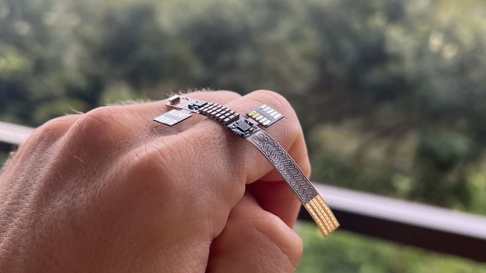
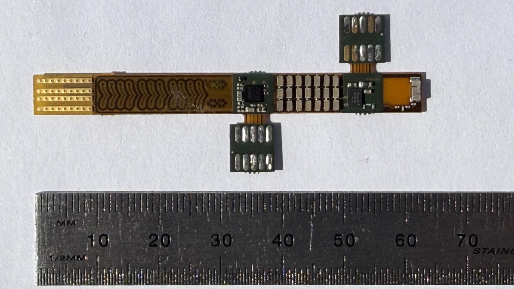

<picture>
  
</picture>

<h1 align="center">Open Ring - the open source Smart Ring project</h1>

[](https://github.com/stawiski/open-ring/stargazers)
[](https://interrupt.memfault.com/blog/smart-ring-development-part-1)

Open Ring is an open hardware and firmware smart ring project. It is a wearable device that can be used to control any BLE connected device (e.g. your phone or computer). It can also be used as a reference for designing other smart ring projects.

# Overview

Open Ring is state-of-the-art smart ring project featuring:
- Ultra low power BLE 5.1
- Capacitive touch sensing for gestures
- Haptic feedback
- Wireless induction charging (with a separate charger)
- Wear detection

All in an absolutely tiny form factor to fit in a ring of less than 3mm thickness (a typical wedding band).
Ring sizes range from US6 to US13.

<picture>
  
</picture>

## Status

Current project status:
- ✅ First article on Memfault has been published ([link to article](https://interrupt.memfault.com/blog/smart-ring-development-part-1))
- ✅ Hardware release

Remaining TODOs:
- Second article on Memfault about hardware development
- Third article on Memfault about firmware development + firmware release
- Update firmware builds (Docker based)
- Update README

## Hardware

Open Ring uses:
- Dialog DA14531 BLE SoC
- Atmel ATSAML10E16A MCU for capacitive touch sensing
- Texas Instruments BQ25125 power management IC
- PulseLARSEN BLE Antenna
- Macronix MX25R2035 FLASH memory
- STMicroelectronics STM32G030F6 MCU for the charger

## Altium libraries

Many components used in this project come from Celestial Altium Library (https://github.com/issus/altium-library). Other components have been drawn from scratch. 3D step files were downloaded from the manufacturer's websites or taken from the Celestial Altium Library.

# License

Open Ring has different licenses for different parts of the project. Please see the LICENSE file for more details.

# Citation

If you use Open Ring in your research or project, please cite:

```bibtex
@software{open_ring2025,
  author = {Stawiski, Mikolaj and Meredith, Joel},
  title = {Open Ring: the open source Smart Ring project},
  year = {2025},
  publisher = {GitHub},
  url = {https://github.com/stawiski/open-ring}
}
```

<br>
<div align="center">Built proudly in Australia with love by <a href="https://www.linkedin.com/in/mstawiski/">Mikolaj Stawiski</a> and <a href="https://www.linkedin.com/in/joelmeredith/">Joel Meredith</a></div>